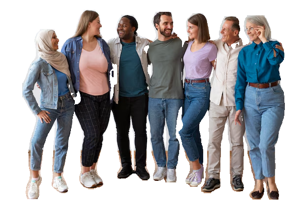
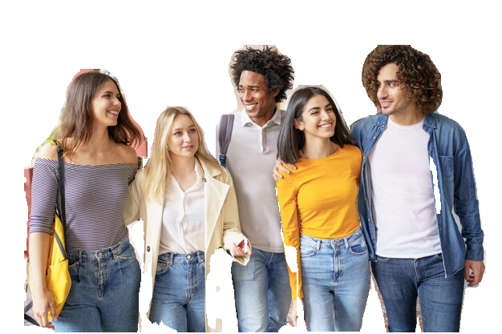
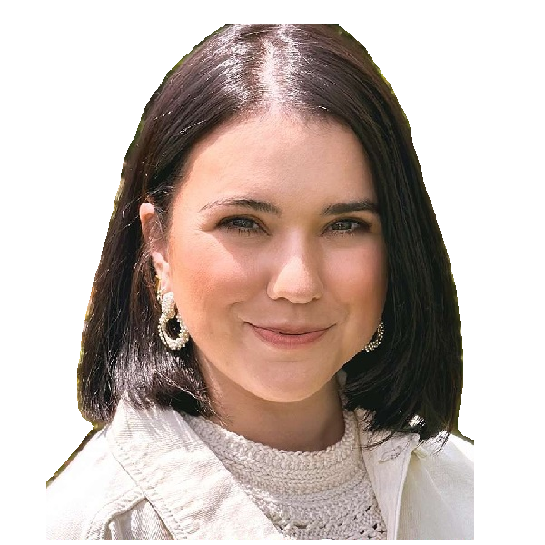

# local_bgrem: YOLOv8 Segmentation Implementation in Python

An attempt to create an offline background removal tool/script that is fast and accurate [WIP]

This project implements background removal using YOLOv8 segmentation in Python. It uses ONNX Runtime to run YOLOv8 models for object detection and segmentation, removing backgrounds from images and providing the option to keep or remove the background.

## Installation

Before running the script, install the necessary dependencies:

```bash
pip install opencv-python numpy onnxruntime
```

## Usage

To run the background removal process on an image, use the following command:

```bash
python bgrem.py --image ./sample_images/input1.jpg --output ./output_images/output1.png
```

### Optional Arguments:
- `--use_cuda`: Use CUDA if available for better performance.
- `--keep_background`: Retain the original background instead of removing it.

## Functionality

The script loads YOLOv8 models for segmentation, non-maximum suppression (NMS), and mask generation. It processes the input image, detects objects, applies background removal, and saves the processed image with transparency.

### Features:
- **YOLOv8 Segmentation**: Uses a YOLOv8 model for segmenting objects in the image.
- **Background Removal**: Removes the background, leaving only the detected objects with transparency.
- **Customizable Output**: Users can keep the background or opt for transparent output.
- **Supports CUDA**: Uses CUDA if available to speed up model inference.

## Example

Given an image `input1.jpg` in the `sample_images` folder, the script will produce a background-removed output image saved as `output1.png` in the `output_images` folder.

```bash
python bgrem.py --image ./sample_images/input1.jpg --output ./output_images/output1.png
```

### Result:
The output will be a PNG image with transparency, showcasing the objects detected by the YOLOv8 segmentation model.

##### Input Images:

  
   
   

##### Output Images:

 
   
  

## How it Works

1. **Loading Models**: The script loads YOLOv8 segmentation models (for object detection and mask generation) using ONNX Runtime.
2. **Preprocessing**: The image is preprocessed to match the model's input dimensions.
3. **Object Detection**: The model detects objects in the image, and the detected bounding boxes are used to generate masks.
4. **Background Removal**: The segmented mask is applied to the original image, removing the background and making the non-background areas transparent.
5. **Output**: The result is saved as a PNG image, which preserves the transparency.

## Dependencies
- **opencv-python**: For image processing tasks.
- **numpy**: For numerical operations.
- **onnxruntime**: For running the ONNX models.

## License

This project is licensed under the MIT License - see the [LICENSE](LICENSE) file for details.

## Acknowledgments

This implementation uses YOLOv8 segmentation models and ONNX Runtime for efficient inference. Special thanks to the original creators of YOLOv8 and ONNX. And Especially this repo where I took the inspiration and models used: https://github.com/Hyuto/yolov8-seg-onnxruntime-web
